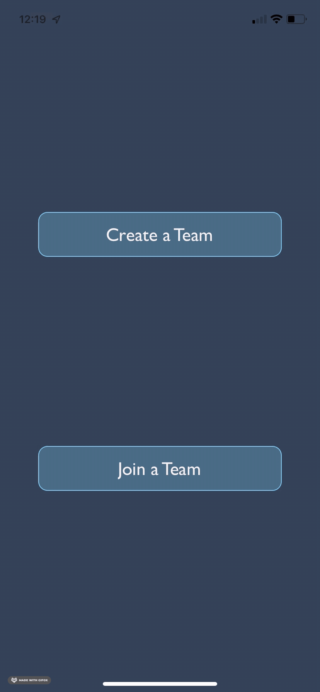
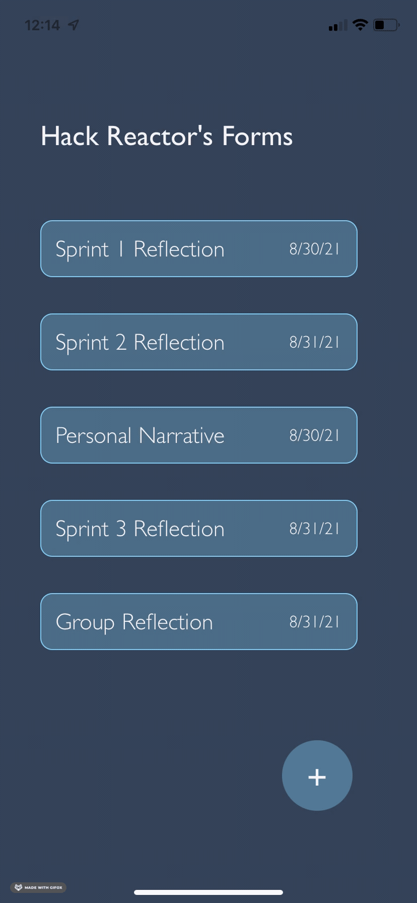

<h2 align="center">FormSpaces</h2>
<h6 align="center">A mobile app prototype created with the intention of streamlining team-based form submission</h6>

<div align="center">
  
</div>

## Key Features
* Creating a team

* Checking status of form submission as a team leader

* Joining a team
* Filling out & submitting forms as a team member
* And more to come!


## How To Use
To clone and run this app, you'll need Git + Node.js on your computer and the Expo Go app on your phone.

### From your command line:


#### Clone this repository
```
$ git clone https://github.com/begoodall/formspaces.git
```

#### Navigate into the repository's root directory
```
$ cd formspaces
```

#### Install dependencies
```
$ npm install
```

#### Run the server
```
$ npm start
```

#### Scan the QR code in the terminal & that's it! Hope you enjoy.
